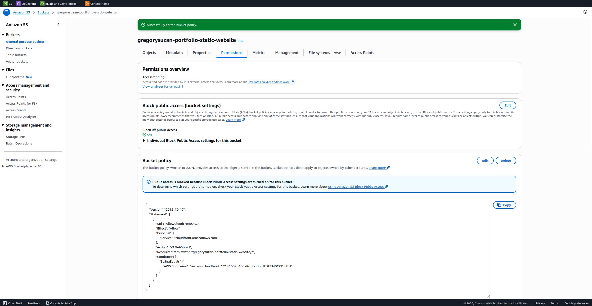
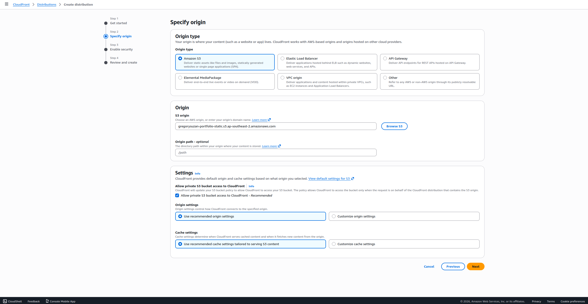
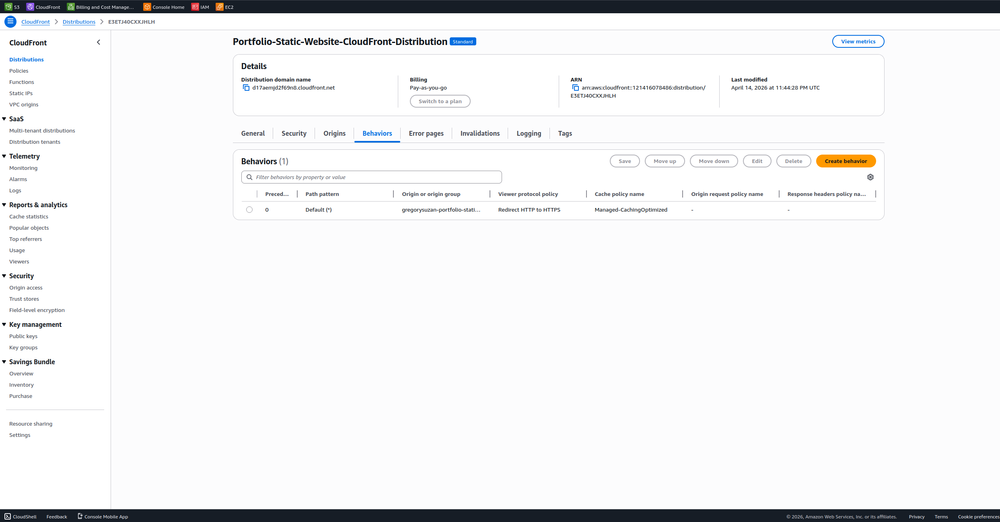
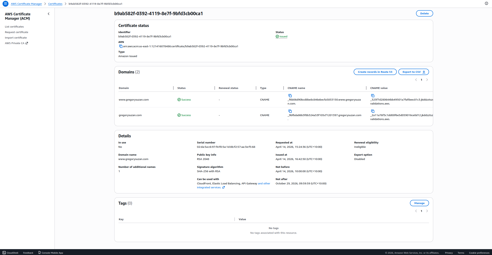

# ☁️ Static Portfolio Website — AWS CloudFront + Private S3


---

## 📌 Overview

Production-grade static website hosting on AWS — built with security and performance as the priority.  
The S3 bucket is fully private (zero public access), content is served exclusively through a CloudFront CDN with HTTPS enforced, and a custom domain is wired up via IONOS DNS using a CNAME record.

This is the foundation of my cloud portfolio — it hosts my personal portfolio website exported from Webflow and delivers it globally with low latency and SSL encryption.

---

## 🏗️ Architecture

```
  Webflow Export
  (HTML/CSS/JS)
       │
       │ manual upload
       ▼
┌─────────────────────────────────────────────────────────────────┐
│                     AWS CLOUD (us-east-1)                       │
│                                                                 │
│   ┌──────────────────────────────────────────────────────────┐  │
│   │                  S3 Bucket (Private)                     │  │
│   │                                                          │  │
│   │   🔒 Block ALL public access enabled                     │  │
│   │   📄 index.html + assets (CSS/JS/images)                 │  │
│   │   🔑 Bucket Policy: allow CloudFront OAC only            │  │
│   └──────────────────────┬───────────────────────────────────┘  │
│                          │  Origin Access Control (OAC)         │
│                          ▼                                      │
│   ┌──────────────────────────────────────────────────────────┐  │
│   │               CloudFront Distribution                    │  │
│   │                                                          │  │
│   │   🌐 Global edge network (200+ locations)                │  │
│   │   🔒 HTTPS only (HTTP → HTTPS redirect)                  │  │
│   │   📄 Default root object: index.html                     │  │
│   │   🔐 SSL Certificate (AWS ACM — us-east-1)               │  │
│   └──────────────────────┬───────────────────────────────────┘  │
│                          │                                      │
│   ┌──────────────────────┴───────────────────────────────────┐  │
│   │               AWS ACM (Certificate Manager)              │  │
│   │   SSL/TLS cert for custom domain — auto-renewed          │  │
│   └──────────────────────────────────────────────────────────┘  │
└─────────────────────────────────────────────────────────────────┘
                           │
                           │ HTTPS request
                           ▼
            ┌──────────────────────────────┐
            │         IONOS DNS            │
            │   CNAME record               │
            │   gregorysuzan.com  ─────────┼──► CloudFront URL
            └──────────────────────────────┘
                           │
                           ▼
                  🌍 Public Internet
                  Browser requests
                  gregorysuzan.com
```

---

## ☁️ AWS Services Used

| Service | Purpose |
|---------|---------|
| Amazon S3 | Private static file storage — HTML, CSS, JS, images |
| S3 Bucket Policy | Restricts access to CloudFront OAC only |
| Amazon CloudFront | Global CDN — content delivery + HTTPS enforcement |
| Origin Access Control (OAC) | Secure link between CloudFront and private S3 |
| AWS ACM | Free SSL/TLS certificate for custom domain |
| IONOS DNS | CNAME record pointing custom domain to CloudFront |

---

## 🔒 Security Architecture

This project deliberately avoids the common mistake of making S3 buckets public. Instead:

| Layer | Implementation |
|-------|---------------|
| S3 Bucket | Block Public Access fully enabled — bucket is 100% private |
| Origin Access Control | Only CloudFront can read from S3 — no direct S3 URL access |
| HTTPS Enforcement | CloudFront redirects all HTTP → HTTPS automatically |
| SSL Certificate | AWS ACM certificate — free, auto-renewing, trusted by all browsers |
| Custom Domain | CNAME via IONOS — no AWS Route 53 required |

> **Why OAC instead of OAI?** Origin Access Control is AWS's current recommended approach (replacing the older Origin Access Identity). OAC supports additional S3 features and is more secure.

---

## 📁 Repository Structure

```
aws-portfolio-cloudfront-private-s3/
├── README.md                  # This file
├── Architecture-diagram.png   # draw.io architecture diagram
└── docs/
    ├── ss01-s3-bucket.png
    ├── ss02-bucket-policy.png
    ├── ss03-cloudfront-distribution.png
    ├── ss04-https-enforced.png
    ├── ss05-acm-certificate.png
    ├── ss06-ionos-cname.png
    └── ss07-live-website.png
```

---

## 🚀 How It Works — Step by Step

### 1 — S3 Bucket Setup
Created a private S3 bucket with all public access blocked. Uploaded the Webflow-exported static files (HTML, CSS, JS, images) directly to the bucket root.

### 2 — CloudFront Distribution
Created a CloudFront distribution pointing to the S3 bucket as its origin. Configured Origin Access Control (OAC) so CloudFront is the only entity with permission to read from S3.

### 3 — Bucket Policy
Attached a bucket policy that explicitly allows `s3:GetObject` only from the CloudFront distribution's service principal. Any direct S3 URL requests are denied.

### 4 — SSL Certificate (ACM)
Requested a free SSL certificate via AWS Certificate Manager in `us-east-1` (required for CloudFront). Validated via DNS. Certificate auto-renews — no manual maintenance needed.

### 5 — Custom Domain + DNS
Added the custom domain as an alternate domain name in CloudFront. Created a CNAME record in IONOS DNS pointing the domain to the CloudFront distribution URL.

### 6 — HTTPS Enforcement
Set CloudFront viewer protocol policy to **Redirect HTTP to HTTPS** — all traffic is encrypted in transit regardless of how the user accesses the URL.

---

## 📸 Screenshots

| Screenshot | Description |
|------------|-------------|
|  | S3 bucket — private, public access blocked |
|  | Bucket policy — CloudFront OAC access only |
|  | CloudFront distribution — deployed and enabled |
|  | HTTPS enforced — HTTP redirects automatically |
|  | ACM SSL certificate — issued and attached |
|  | IONOS DNS — CNAME record pointing to CloudFront |
|  | Live website — custom domain, HTTPS, serving globally |

---

## 💡 Key Decisions & Why

**Why not just make S3 public?**  
Public S3 buckets expose your origin URL, allow direct access bypassing CloudFront, and are a common misconfiguration that leads to data breaches. Private S3 + OAC is the production-correct approach.

**Why CloudFront instead of just S3 static hosting?**  
CloudFront gives you HTTPS on a custom domain (S3 static hosting only supports HTTP on custom domains), global edge caching for faster load times worldwide, and DDoS protection via AWS Shield Standard — all included at no extra cost.

**Why IONOS instead of Route 53?**  
The domain was already registered with IONOS. A simple CNAME record is all that's needed to point to CloudFront — no need to migrate DNS to Route 53 for a static site.

**Why ACM for SSL?**  
AWS Certificate Manager certificates are free, automatically renewed, and natively integrated with CloudFront. No manual cert management or third-party tools needed.

---

## 🧠 What I Learned

- How to architect a secure static hosting setup without ever exposing S3 publicly
- The difference between Origin Access Control (OAC) and Origin Access Identity (OAI) and why OAC is now preferred
- How CloudFront distributions work — origins, behaviours, edge caching, and HTTPS enforcement
- How to request and validate SSL certificates via AWS ACM using DNS validation
- How to wire a custom domain from a third-party registrar (IONOS) to a CloudFront distribution using a CNAME record
- Why HTTP → HTTPS redirect matters for both security and SEO

---

## 💰 Cost

| Service | Cost |
|---------|------|
| S3 Storage | ~$0.00 (well within free tier for static files) |
| CloudFront | Free tier: 1TB data transfer + 10M requests/month |
| ACM Certificate | Free (for use with CloudFront) |
| IONOS DNS | Included with domain registration |

**Estimated monthly cost: $0.00** for a low-traffic portfolio site within AWS Free Tier limits.

---

## 👤 Author

**Gregory Suzan**  
6+ year graphic designer transitioning into cloud computing  
📍 Australia | ☁️ AWS | 🎨 Webflow  
[GitHub](https://github.com/GregorySuzan)
