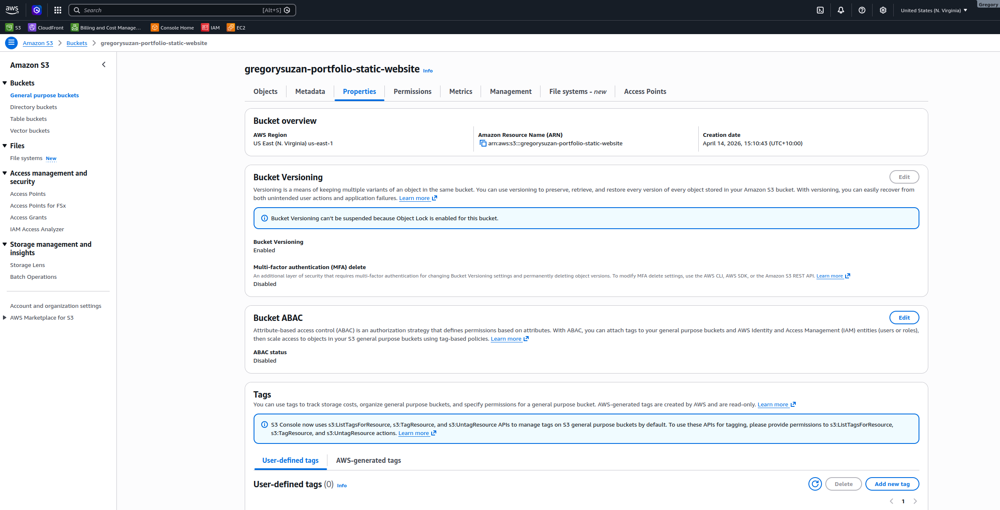
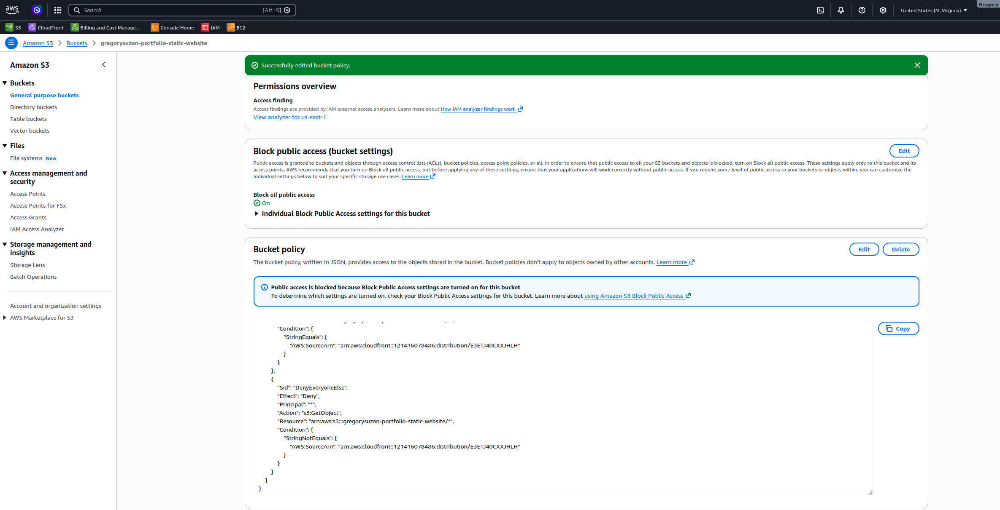
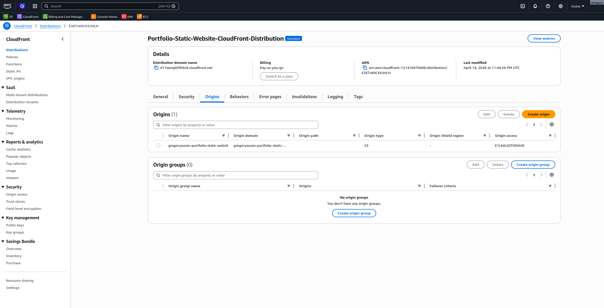
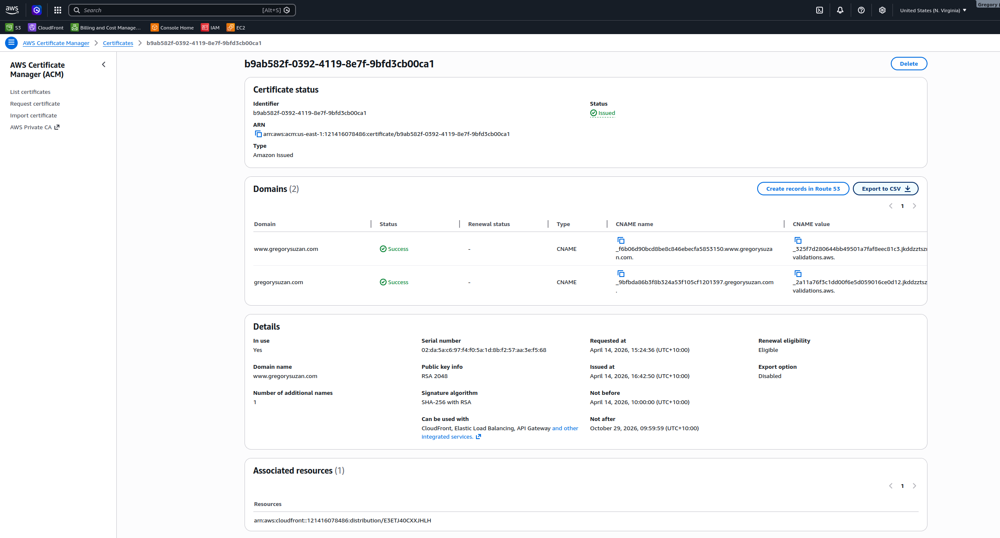
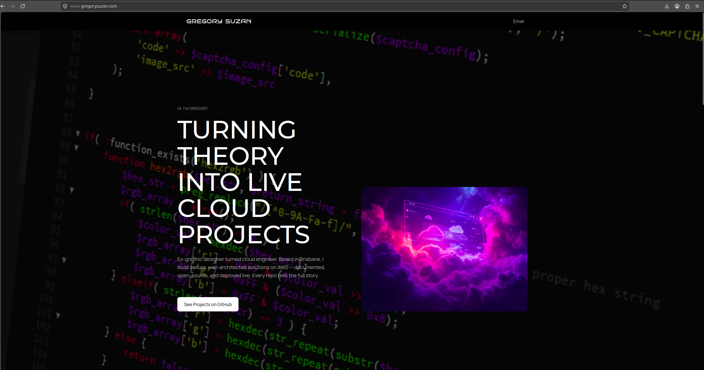
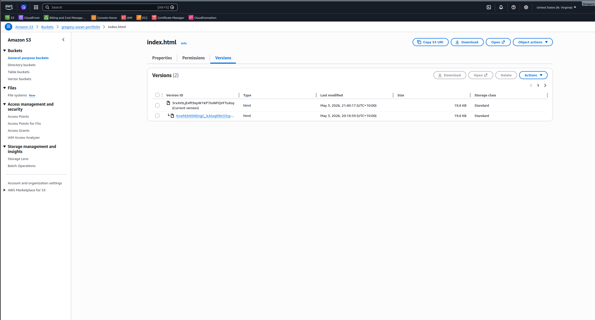

# ☁️ Secure Static Hosting — AWS CloudFront + Private S3


---

## 📌 Overview

Production-grade static website hosting on AWS — built with security, resilience, and cost-optimisation as the priority.

The S3 bucket is fully private with zero public access. Content is delivered globally through CloudFront CDN with HTTPS enforced end-to-end. S3 Versioning protects against accidental deletion. A custom OAC deny bucket policy ensures files are only ever served through CloudFront — never directly from S3.

This is the foundation of my cloud portfolio — it hosts my personal portfolio website at gregorysuzan.com and demonstrates core SAA content delivery and storage architecture patterns.

---

## 🏗️ Architecture

```
  Webflow Export (HTML/CSS/JS)
         │
         │ aws s3 sync (deploy command)
         ▼
┌─────────────────────────────────────────────────────────────────┐
│                    AWS CLOUD (us-east-1)                        │
│                                                                 │
│  ┌──────────────────────────────────────────────────────────┐   │
│  │                 S3 Bucket (Private Vault)                │   │
│  │                                                          │   │
│  │  🔒 Block ALL public access — enabled                    │   │
│  │  📁 Versioning enabled — every change recoverable        │   │
│  │  🔑 Bucket Policy: DENY if not from CloudFront OAC       │   │
│  │  ♻️  Lifecycle: delete old versions after 30 days        │   │
│  └──────────────────────┬───────────────────────────────────┘   │
│                         │  Origin Access Control (OAC)          │
│                         │  CloudFront identity presents itself  │
│                         │  S3 verifies it → allows read         │
│                         ▼                                       │
│  ┌──────────────────────────────────────────────────────────┐   │
│  │              CloudFront Distribution                     │   │
│  │                                                          │   │
│  │  🌐 200+ edge locations globally                         │   │
│  │  🔒 HTTPS only — HTTP redirects automatically            │   │
│  │  📄 Default root object: index.html                      │   │
│  │  🛡️  AWS Shield Standard — DDoS protection (free)        │   │
│  │  📦 Custom error pages (404 → /404.html)                 │   │
│  │  ⚡ Cache behaviours: HTML short TTL, assets long TTL    │   │
│  └──────────────────────┬───────────────────────────────────┘   │
│                         │                                       │
│  ┌──────────────────────┴───────────────────────────────────┐   │
│  │              AWS ACM (Certificate Manager)               │   │
│  │  Free SSL/TLS cert — auto-renewed — DNS validated        │   │
│  └──────────────────────────────────────────────────────────┘   │
│                                                                 │
│  ┌──────────────────────────────────────────────────────────┐   │
│  │  CloudFormation Stack                                    │   │
│  │  Entire infrastructure defined as YAML code              │   │
│  │  Deploy/destroy in minutes — fully reproducible          │   │
│  └──────────────────────────────────────────────────────────┘   │
└─────────────────────────────────────────────────────────────────┘
         │
         │ HTTPS
         ▼
  IONOS DNS — CNAME → CloudFront distribution URL
         │
         ▼
  🌍 Browser — gregorysuzan.com
```

> 📐 Full draw.io diagram: [`docs/Architecture-diagram.png`](docs/architecture-diagram.png)

---

## ☁️ AWS Services Used

| Service | Purpose | SAA Domain |
|---------|---------|-----------|
| Amazon S3 | Private static file storage with versioning | Resilient + Secure |
| S3 Versioning | Protects against accidental deletion/overwrites | Resilient |
| S3 Lifecycle Rules | Auto-delete old versions after 30 days | Cost-Optimised |
| Amazon CloudFront | Global CDN with edge caching + HTTPS | Performance |
| Origin Access Control | Secure S3 → CloudFront connection | Secure |
| AWS ACM | Free SSL/TLS certificate, auto-renewed | Secure |
| IONOS DNS | CNAME record pointing domain to CloudFront | Networking |

---

## 🔒 Security Architecture — Three Layers

### Layer 1 — S3 Block Public Access
All four Block Public Access settings are enabled on the bucket. Even if someone accidentally adds a public bucket policy or ACL, this overrides it. There is no path to read files directly from S3.

### Layer 2 — OAC Deny Policy (upgraded from original)
The bucket policy now has an explicit DENY condition:

```json
{
  "Effect": "Deny",
  "Principal": "*",
  "Action": "s3:GetObject",
  "Resource": "arn:aws:s3:::your-bucket/*",
  "Condition": {
    "StringNotEquals": {
      "AWS:SourceArn": "arn:aws:cloudfront::ACCOUNT:distribution/DIST_ID"
    }
  }
}
```

This means: deny ALL requests that do NOT come from this specific CloudFront distribution. Even requests using valid AWS credentials are denied unless they come through CloudFront OAC.

### Layer 3 — HTTPS Enforcement
CloudFront viewer protocol policy is set to Redirect HTTP to HTTPS. All traffic is encrypted in transit regardless of how the user accesses the URL.

---

## 📦 S3 Versioning — Why It Matters

S3 Versioning keeps every version of every file. When enabled:

- Deploying new content creates a new version — previous version is preserved
- Accidentally deleting a file creates a delete marker — the file still exists underneath
- You can restore any previous version at any time

**Without versioning:** deploy a broken version → your site is broken and the old version is gone forever.

**With versioning:** deploy a broken version → roll back to the previous version in 30 seconds.

Lifecycle rule auto-deletes versions older than 30 days to control storage costs.

**SAA exam note:** Versioning is a prerequisite for S3 Cross-Region Replication (CRR). If an exam question mentions CRR, versioning must be enabled on both source and destination buckets.

---

## 📁 Repository Structure

```
aws-portfolio-cloudfront-private-s3/
├── README.md
├── Architecture-diagram.png
└── docs/
    ├── ss01-s3-private-versioning.png
    ├── ss02-bucket-policy-oac-deny.png
    ├── ss03-cloudfront-distribution.png
    ├── ss04-acm-certificate.png
    ├── ss05-live-website.png
    └── ss06-s3-versions.png
```

---

## 🚀 Update the Website

```bash
# Upload new or changed files to S3
aws s3 sync ./your-webflow-export s3://YOUR_BUCKET_NAME --delete

# Invalidate CloudFront cache so changes go live immediately
aws cloudfront create-invalidation \
  --distribution-id YOUR_DIST_ID \
  --paths "/*"
```

Or manually: drag files into S3 → CloudFront → Invalidations → Create → `/*`

> Changes are live within ~30 seconds of invalidation completing.

---

## 📸 Screenshots

| Screenshot | Description |
|------------|-------------|
|  | **S3 Bucket** — Versioning enabled, Block all public access ON |
|  | **Bucket Policy** — OAC deny condition, only CloudFront can read |
|  | **CloudFront Distribution** — Deployed, S3 origin with OAC attached |
|  | **ACM Certificate** — Issued, DNS validated for gregorysuzan.com |
|  | **Live Website** — gregorysuzan.com serving over HTTPS 🔒 |
|  | **S3 Versioning** — Multiple versions of index.html recoverable |

---

## 💡 Key Decisions & Why

**Why OAC instead of OAI?**
Origin Access Identity (OAI) is the older approach — still works but AWS recommends Origin Access Control for new distributions. OAC supports additional S3 features including SSE-KMS encryption and supports all S3 regions. For a portfolio, using the current recommended approach is important.

**Why versioning instead of just backups?**
Manual backups require someone to remember to do them. Versioning is automatic — every single change is preserved with zero effort. The 30-day lifecycle rule keeps costs near zero while still providing a meaningful recovery window.

**Why IONOS instead of Route 53?**
The domain was already registered with IONOS. A single CNAME record is all that's needed. Migrating DNS to Route 53 adds complexity and cost for no benefit on a static site. Knowing when NOT to add AWS services is also an SAA skill.

**Why CloudFormation?**
If this server were to disappear tomorrow, CloudFormation recreates the entire stack in under 5 minutes. Console-built infrastructure is undocumented and unreproducible. This is the difference between a hobby project and production-grade work.

---

## 🧠 What I Learned — SAA Concepts

- S3 storage classes and when to use each (Standard, IA, Glacier)
- S3 Versioning, MFA Delete, and lifecycle policies
- The difference between OAC and OAI — and why OAC is preferred
- How CloudFront caching works — TTLs, cache behaviours, invalidation
- ACM certificate validation methods (DNS vs email)
- Why HTTPS matters for both security and SEO
- How OAC deny bucket policies work — explicit deny overrides everything
- When NOT to add extra AWS services (IONOS DNS vs Route 53 — right tool for the job)

---

## 💰 Cost

All resources within AWS Free Tier for a low-traffic portfolio site. CloudFront: 1TB data transfer/month free. S3: 5GB storage free. ACM: free for use with CloudFront. Versioning adds minimal storage cost covered by the 30-day lifecycle rule.

---

## 👤 Author

**Gregory Suzan** — Cloud Engineer | AWS SAA Candidate | Ex-Graphic Designer
📍 Brisbane, Australia | [GitHub](https://github.com/GregorySuzan)
