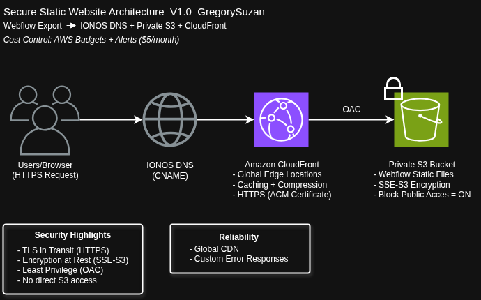

# aws-portfolio-cloudfront-private-s3
Secure static portfolio website using Webflow → Private S3 Bucket + CloudFront CDN with IONOS DNS (CNAME)

# AWS Portfolio - CloudFront + Private S3

**Live Demo:** https://www.gregorysuzan.com (once deployed as 13/04/2026 in Draft)  
**Project Type:** V1 - Secure Static Website

My first hands-on AWS project while transitioning from 6+ years in graphic design into cloud architecture & security.

---

### What I Built
- Static website exported from Webflow
- Private S3 bucket (never public)
- CloudFront CDN with HTTPS and caching
- Custom domain via IONOS DNS (CNAME)

---

### Architecture Diagram

---

### Security Highlights
- S3 bucket is completely private (Block Public Access = ON)
- Only CloudFront can access S3 via Origin Access Control (OAC)
- SSE-S3 encryption at rest
- HTTPS (TLS) in transit via ACM certificate
- Least privilege access

---

### Well-Architected Framework

**Security Pillar**  
- Encryption at rest and in transit  
- Least privilege (OAC + bucket policy)  
- No direct public access to S3

**Reliability Pillar**  
- Global edge locations with CloudFront  
- Caching for better performance  
- Custom error responses

---

### Cost Control (SysOps)
- AWS Budget created with $5/month threshold
- Email alerts at 80% and 100%
- Expected monthly cost with low traffic: **$0**

---

### Technologies Used
- Webflow (static export)
- Amazon S3 (private storage)
- Amazon CloudFront (CDN + HTTPS)
- IONOS DNS (CNAME)

---

### Upgrade Path (Future Versions)
- **V2**: Contact form using API Gateway + Lambda + SES
- **V2.5**: CI/CD with GitHub Actions
- **V3**: Full Infrastructure as Code with Terraform
- **V4**: CloudWatch monitoring + alarms + logging

---

**Built by Gregory Suzan**  
Graphic Designer transitioning into Cloud Security & Architecture  
Willing to relocate Australia-wide | Permanent Resident

---

*Last updated: April 2026*
